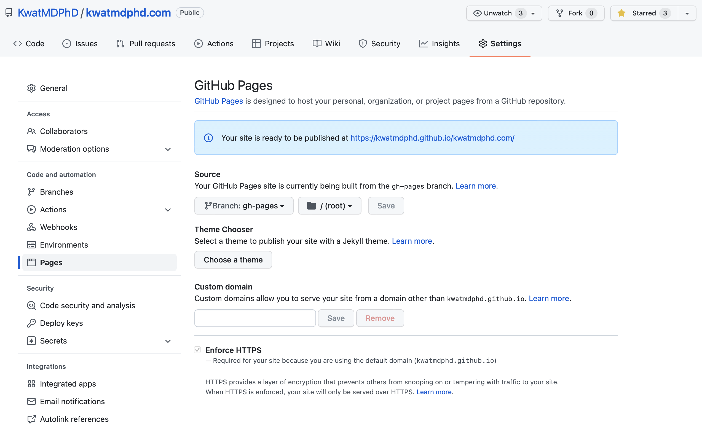

Make the most minimal app (select `Skeleton project` and no to everything else)

## Make one

```bash
npm init svelte@next
```

Install dependencies

```bash
npm install
```

Run the app

```bash
npm run dev -- --open
```

## Take a look

Build the app

```bash
ls -l .svelte-kit
```

```bash
npm run build
```

```bash
ls -l .svelte-kit
```

Preview the build

```bash
npm run preview -- --open
```

## Publish to GitHub Pages

Read https://kit.svelte.dev/docs#adapters-supported-environments-static-sites and follow:

Install `adapter-static` (for only during development)

```bash
npm install --save-dev @sveltejs/adapter-static@next 
```

Edit `svelte.config.js`

```diff
-import adapter from '@sveltejs/adapter-auto';
+import adapter from '@sveltejs/adapter-static';
```

Build

```bash
ls -l .
```

```bash
npm run build
```

```bash
ls -l .
```

Use `gh-pages` to deploy the app to `gh-pages` branch:

```bash
npm install --save-dev gh-pages
```

```bash
npx gh-pages --dist build --dotfiles
```

`gh-pages` updates the repository


Set `Pages`



---

##

Carry `.nojekyll` so tha GitHub nojekyll does not mess with this app

```bash
touch static/.nojekyll
```

##

Do all https://svelte.dev/tutorial/basics.

##

Do all https://kit.svelte.dev/docs.
